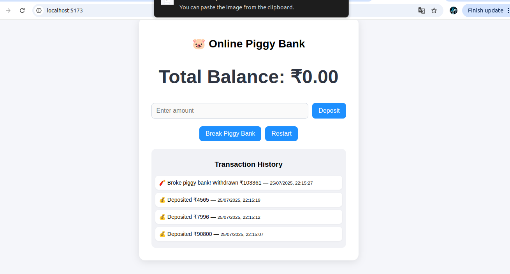
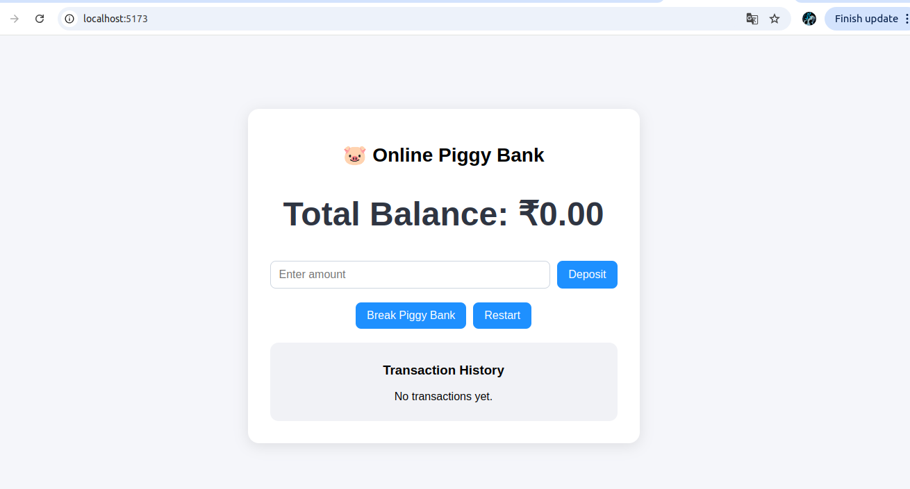

# 🐷 Online Piggy Bank

An interactive single-page web app to simulate a virtual piggy bank. Users can deposit money, view transaction history grouped by date, break the piggy bank to withdraw savings, and restart fresh — all with clean UI and persistent local storage.

---

## 🚀 Features

- ✅ Add money with optional notes/tags
- ✅ See live balance updates
- ✅ Grouped transaction history (by date)
- ✅ Break the piggy bank to withdraw all savings
- ✅ Restart the piggy bank (clears all history and balance)
- ✅ LocalStorage-based persistence
- ✅ Modular, component-based React design
- ✅ Responsive UI with subtle transitions

---

## 🛠️ Tech Stack

- **Frontend**: React (with Hooks, functional components)
- **Styling**: CSS Modules
- **State Management**: React Context API
- **Persistence**: `localStorage` (no backend required)

---

## 📸 Screenshots

| 💰 Add Money | 📜 View History | 💥 Break & Restart |
|-------------|------------------|--------------------|
|  |  |  |

> demo_video :"https://drive.google.com/file/d/1H5uIvVmSfrU8KZ4fy9OqYS7ZIf-3vP7R/view?usp=sharing"

---

## 📦 Installation & Setup

1. **Clone the repo**

   ```bash
   git clone https://github.com/your-username/online-piggy-bank.git
   cd online-piggy-bank
